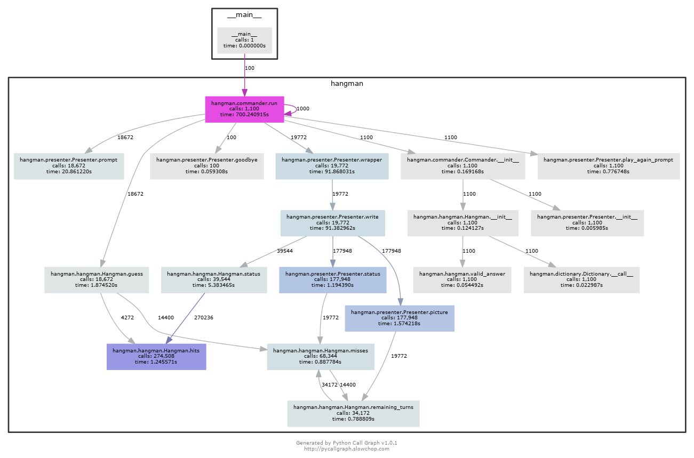

# Hangman [](https://travis-ci.org/bionikspoon/Hangman)
#### A Python TDD Experiment
My first python agnostic, tox tested, travis-backed, program!

Has **very high** unit test coverage, with passing tests on every version of python including PyPy.

**Compatibility**
- Python 2.6
- Python 2.7
- Python 3.2
- Python 3.3
- Python 3.4
- PyPy


## Usage

```sh
git clone git@github.com:bionikspoon/Hangman.git
cd Hangman/
mkvirtualenv hangman  # optional for venv users
pip install .
hangman 
```

#### Uninstall
```sh
rmvirtualenv hangman
```
or
```sh
workon hangman # for venv users
pip uninstall python-hangman
deactivate # for venv users
```

## Goal
Learning!  Python in this case.  I'm particularly interested in testing and Test Driven Development.  This was a TDD exercise.

Also, explored:
- Tox, test automation
- Travis CI
- Python version agnostic programming
- Setuptools

## Design
There are 3 main components that run the game:  [hangman.Hangman](hangman/hangman.py#L7), [hangman.Commander](hangman/hangman.py#L7), and [hangman.Presenter](hangman/presenter.py#L6)

The entirety of the game logic is contained in [hangman.Hangman](hangman/hangman.py#L7).  You could technically play the game in the python console by instantiating the class, submitting guesses with `Hangman.guess(self, letter)` and printing the game state.

For example:

```python
>>> from hangman.hangman import Hangman
>>> game = Hangman(answer='hangman')
>>> game.guess('a')
hangman(status='_A___A_', misses=[], remaining_turns=10)
>>> game.guess('n').guess('z').guess('e')
hangman(status='_AN__AN', misses=['Z', 'E'], remaining_turns=8)
>>> game.status, game.misses, game.remaining_turns
('_AN__AN', ['Z', 'E'], 8)
```

[hangman.Presenter](hangman/presenter.py#L6) is a simple presentation layer.  It handles printing the art to the console, and collecting input from the user  

The  [hangman.Commander](hangman/hangman.py#L7) is exactly that, the commander, the director, the maestro, the tour guide.  It guides you, the user, through the game.  It tells the presenter module what to print and what data to collect.  The commander updates the state of the game and handles game events. 

#### Design Reasoning

This design pattern was the right choice, because I didn't know, in advance, how the game was to interact with the user.  Curses was on the table, it still is.  But, following TDD, there needed to be an immediate working solution that could be swapped out in the future.  And that's what this design allows.  The presenter class can changed to any other presentation layer with out changing the game.

**Mistakes:** The presenter class, in my mind, is a static class.  Python does not play friendly with static classes OR I'm doing it wrong.  This could be refactored in a meaningful way.

## Call Diagram

